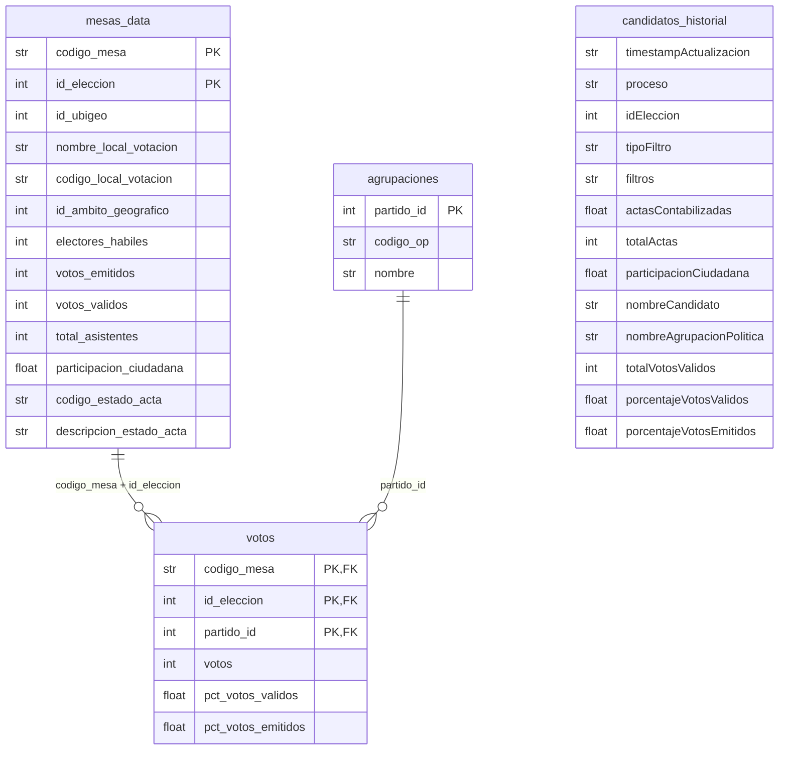

# ONPE Scraper 2026 — Segunda Vuelta Presidencial

Extractor autónomo de resultados electorales desde la API interna de [ONPE](https://resultadoelectoral.onpe.gob.pe) para las Elecciones Generales 2026. Funciona sin depender del frontend Angular oficial.

Dos modos de operación:
- **`resumen`** — totales nacionales y porcentajes por candidato (primera y segunda vuelta)
- **`mesas`** — descubrimiento y scraping autónomo de las ~92 000 mesas de votación, con reanudación incremental

> [!NOTE]
> El modo `mesas` está preparado para la segunda vuelta. Hasta que ONPE publique `mesas.json` con los datos reales (~92k mesas), el endpoint devuelve registros de demo y el scraper emitirá una advertencia.

---

## Instalación

```powershell
python -m venv .venv
.\.venv\Scripts\Activate.ps1
pip install -r requirements.txt
```

**Requisitos:** Python 3.11+, dependencias en `requirements.txt` (`curl_cffi` es obligatorio — ONPE requiere fingerprinting de Chrome en todos sus endpoints).

---

## Uso

### Modo resumen — totales nacionales

```powershell
# Una sola extracción (detecta la elección activa automáticamente)
python -m src.onpe_scraper.main

# Bucle de auditoría cada 60 s
python -m src.onpe_scraper.main --intervalo-segundos 60

# Filtrar por departamento (ubigeo Lima = 15)
python -m src.onpe_scraper.main --tipo-filtro ubigeo_nivel_01 --ubigeo 15

# Filtrar por provincia / distrito
python -m src.onpe_scraper.main --tipo-filtro ubigeo_nivel_02 --ubigeo 1501
python -m src.onpe_scraper.main --tipo-filtro ubigeo_nivel_03 --ubigeo 150101

# Ámbito geográfico (1 = Perú, 2 = Extranjero)
python -m src.onpe_scraper.main --tipo-filtro ambito_geografico --id-ambito-geografico 2
```

### Modo mesas — scraping por mesa de votación

```powershell
# Primera ejecución: descubre todas las mesas desde mesas.json
python -m src.onpe_scraper.main --modo mesas --redescubrir

# Siguientes ejecuciones: retoma solo las mesas pendientes (no contabilizadas)
python -m src.onpe_scraper.main --modo mesas

# Auditoría continua hasta 100 % contabilizado
python -m src.onpe_scraper.main --modo mesas --intervalo-segundos 120

# Opciones avanzadas
python -m src.onpe_scraper.main --modo mesas --redescubrir \
  --max-workers 5 \
  --batch-size 500 \
  --timeout 20 \
  --verbose
```

---

## Salidas

```
output/                          ← archivos analíticos (tab-delimited UTF-8)
  mesas_data.txt                 ← una fila por mesa de votación
  votos.txt                      ← votos por mesa × partido
  agrupaciones.txt               ← catálogo de agrupaciones políticas
  candidatos_historial.txt       ← serie histórica de totales por candidato

work/                            ← estado interno del scraper (no commitear)
  mesas_pendientes.txt           ← mesas aún no contabilizadas (resume file)
  snapshot_YYYYMMDDTHHMMSSZ.json ← dump crudo de la API por cada corrida
```

### Esquema de tablas

#### `mesas_data.txt`
| Campo | Tipo | Descripción |
|---|---|---|
| `codigo_mesa` | str(6) | PK — código de mesa |
| `id_eleccion` | int | PK — ID de elección |
| `id_ubigeo` | int | Código ubigeo del local |
| `nombre_local_votacion` | str | Nombre del local |
| `codigo_local_votacion` | str | Código del local |
| `id_ambito_geografico` | int | 1 = Perú, 2 = Exterior |
| `electores_habiles` | int | Padrón |
| `votos_emitidos` | int | Total votos emitidos |
| `votos_validos` | int | Total votos válidos |
| `total_asistentes` | int | Asistencia registrada |
| `participacion_ciudadana` | float | % participación |
| `codigo_estado_acta` | str | `C` = Contabilizada |
| `descripcion_estado_acta` | str | Estado legible |

#### `votos.txt`
| Campo | Tipo | Descripción |
|---|---|---|
| `codigo_mesa` | str(6) | FK → mesas_data |
| `id_eleccion` | int | FK → mesas_data |
| `partido_id` | int | FK → agrupaciones |
| `votos` | int | Votos absolutos |
| `pct_votos_validos` | float | % sobre votos válidos |
| `pct_votos_emitidos` | float | % sobre votos emitidos |

#### `agrupaciones.txt`
| Campo | Tipo | Descripción |
|---|---|---|
| `partido_id` | int | PK |
| `codigo_op` | str | Código oficial ONPE |
| `nombre` | str | Nombre completo |

#### `candidatos_historial.txt`
Serie temporal de totales nacionales, una fila por candidato por corrida. Útil para graficar la evolución del conteo.

### Modelo relacional



### Carga en pandas

```python
import pandas as pd

mesas     = pd.read_csv("output/mesas_data.txt",          sep="\t", dtype={"codigo_mesa": str})
votos     = pd.read_csv("output/votos.txt",               sep="\t", dtype={"codigo_mesa": str})
agrup     = pd.read_csv("output/agrupaciones.txt",        sep="\t")
historial = pd.read_csv("output/candidatos_historial.txt", sep="\t")

# ── Votos totales por partido (segunda vuelta) ──────────────────────────────
totales = (
    votos.merge(agrup, on="partido_id")
         .groupby("nombre", as_index=False)["votos"]
         .sum()
         .sort_values("votos", ascending=False)
)

# ── Participación promedio por departamento (ubigeo 2 dígitos) ─────────────
mesas["dep"] = mesas["id_ubigeo"].astype(str).str.zfill(6).str[:2]
participacion_dep = (
    mesas.groupby("dep")["participacion_ciudadana"].mean().sort_values(ascending=False)
)

# ── Mesas aún no contabilizadas ────────────────────────────────────────────
pendientes = mesas[mesas["codigo_estado_acta"] != "C"]

# ── Evolución del conteo en el tiempo (historial) ──────────────────────────
historial["ts"] = pd.to_datetime(historial["timestampActualizacion"])
evolucion = historial.pivot_table(
    index="ts", columns="nombreAgrupacionPolitica",
    values="porcentajeVotosValidos", aggfunc="last"
)
```

---

## Arquitectura

```
src/onpe_scraper/
├── models.py      # Dataclasses: MesaData, VotoData, AgrupacionData, MesaResult
├── client.py      # OnpeClient — toda la lógica HTTP (curl_cffi + Chrome impersonation)
├── exporters.py   # Escritura de archivos: upsert TSV, snapshot JSON
└── main.py        # CLI (argparse): modos resumen / mesas, ThreadPoolExecutor
```

**Flujo modo mesas:**
```
proceso-electoral-activo → id_eleccion
assets/data/mesas.json   → lista de códigos (~92k)
        ↓ (parallel, 5 workers)
/actas/buscar/mesa?codigoMesa=XXXXXX  →  MesaResult
        ↓ (cada 500 mesas)
upsert → mesas_data.txt / votos.txt / agrupaciones.txt
        ↓ (al finalizar)
mesas_pendientes.txt  ← solo las no contabilizadas
```

---

## Notas técnicas

- **Chrome impersonation obligatoria:** todos los endpoints de ONPE retornan el SPA de Angular sin `curl_cffi` con `impersonate="chrome124"`. La librería estándar `requests` no funciona.
- **Upsert incremental:** los TXT usan el patrón load → merge → rewrite con claves compuestas `(id_eleccion, codigo_mesa)`. Cada corrida actualiza sin duplicar.
- **Resume automático:** `work/mesas_pendientes.txt` guarda las mesas no contabilizadas. La próxima corrida sin `--redescubrir` solo re-consulta esas.
- **Retry con backoff:** `get_mesa_acta` reintenta 3 veces con espera exponencial (0.5 s, 1 s, 2 s).
- Si ONPE cambia la forma del payload, solo hay que editar `client.py`.

---

## Proyecto relacionado

[onpescraper](https://github.com/oscarzamora/onpescraper) — primera vuelta (con lista de mesas manual).

---

## Licencia

MIT
