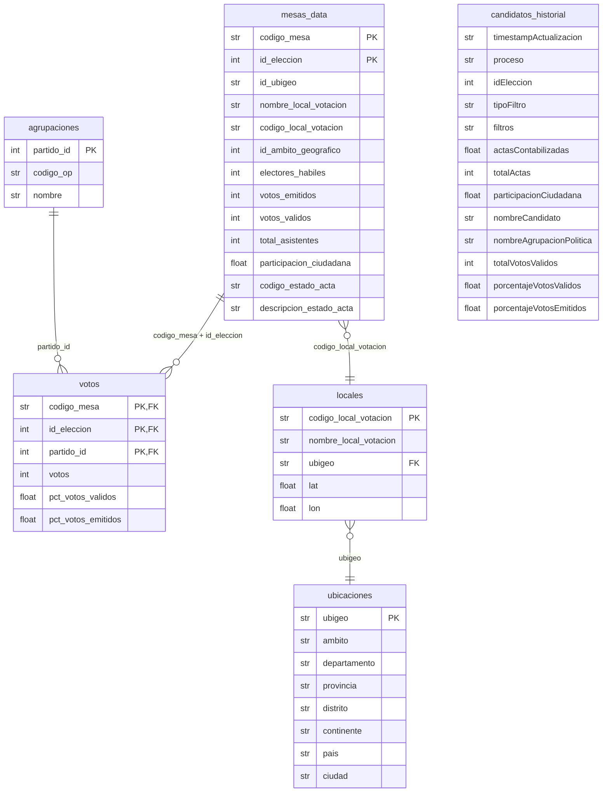

# ONPE Scraper 2026 — Segunda Vuelta Presidencial

> **Transparencia electoral independiente para las Elecciones Generales del Perú 2026.**
>
> Este proyecto extrae los resultados de la segunda vuelta presidencial directamente desde la API interna de ONPE — la misma fuente que alimenta el sitio oficial [resultadosegundavuelta.onpe.gob.pe](https://resultadosegundavuelta.onpe.gob.pe/main/resumen) — y los publica como datos abiertos y verificables en este repositorio, mesa por mesa, en tiempo real.

Los datos se actualizan automáticamente vía **GitHub Actions cada 10 minutos** a partir del domingo 7 de junio de 2026 a las 6 PM EST. Cualquier persona puede auditar el código, los datos y la metodología.

---

## API de ONPE — Endpoints conocidos (segunda vuelta 2026)

> [!IMPORTANT]
> Todos los endpoints requieren **Chrome fingerprinting** (`curl_cffi` con `impersonate="chrome124"`). La librería estándar `requests` recibe el SPA Angular en vez del JSON. Esto fue descubierto mediante ingeniería inversa del frontend oficial.

**Base URL:** `https://resultadosegundavuelta.onpe.gob.pe`

| Endpoint | Método | Descripción |
|---|---|---|
| `/presentacion-backend/proceso/proceso-electoral-activo` | GET | Retorna el `idEleccion` del proceso activo. Auto-detecta segunda vuelta. |
| `/assets/data/mesas.json` | GET | Fuente opcional de códigos de mesa (puede no estar publicada o devolver contenido placeholder según despliegue). |
| `/presentacion-backend/ubigeos/dep-prov-distritos?idEleccion={id}` | GET | Jerarquía geográfica completa: 2 102 ubigeos únicos (Perú: dept/prov/dist; exterior: continente/país/ciudad). |
| `/presentacion-backend/actas/buscar/mesa?codigoMesa={codigo}&idEleccion={id}` | GET | Acta de una mesa: votos por partido, estado (`C`=Contabilizada), datos del local. HTTP 204 = mesa sin datos aún. |
| `/presentacion-backend/totales/...` | GET | Totales nacionales / por filtro geográfico (modo resumen). |
| `/presentacion-backend/candidatos/...` | GET | Candidatos con porcentajes de votos (modo resumen). |

**Envelope de respuesta estándar:**
```json
{ "data": <payload> }
```

**Estados del acta (`codigo_estado_acta`):**
| Código | Descripción |
|---|---|
| `C` | Contabilizada — datos finales |
| `P` | Procesada — pendiente de contabilización |
| `N` | No transmitida |

**Filtros geográficos disponibles (`tipoFiltro`):**
```
eleccion            → nacional
ambito_geografico   → 1=Perú, 2=Exterior
ubigeo_nivel_01     → departamento (ej: 15 = Lima)
ubigeo_nivel_02     → provincia    (ej: 1501 = Lima Provincia)
ubigeo_nivel_03     → distrito     (ej: 150101 = Lima Cercado)
```

> [!NOTE]
> Estos endpoints fueron identificados el 2 de junio de 2026 analizando el tráfico del frontend Angular oficial. ONPE podría modificarlos sin previo aviso. Si detectas cambios, abre un issue.

---

## Datos en vivo

Los archivos `output/*.txt` de este repositorio se actualizan automáticamente durante el escrutinio:

```
output/
  ubicaciones.txt       ← jerarquía geográfica completa (2 102 ubigeos)
  mesas_data.txt        ← una fila por mesa (estado, participación, local)
  votos.txt             ← votos por mesa × partido
  agrupaciones.txt      ← catálogo de partidos
  locales.txt           ← locales de votación con coordenadas opcionales
    locales_reasignados_segunda_vuelta_2026.txt ← mapeo de locales reasignados (origen → nuevo)
```

Cada commit de datos tiene el mensaje `data: YYYY-MM-DDTHH:MM:SSZ — pendientes: N mesas`.

---

## Usar los datos (sin instalar nada)

Los datos ya están en este repo y se actualizan solos. Descarga directa:

```bash
# Todos los archivos de una vez
git clone https://github.com/oscarzamora/onpe-scraper-2026-2.git
cd onpe-scraper-2026-2/output

# O un archivo individual (sin clonar)
curl -O https://raw.githubusercontent.com/oscarzamora/onpe-scraper-2026-2/main/output/mesas_data.txt
curl -O https://raw.githubusercontent.com/oscarzamora/onpe-scraper-2026-2/main/output/votos.txt
```

---

## Instalación

```powershell
python -m venv .venv
.\.venv\Scripts\Activate.ps1
pip install -r requirements.txt
```

**Requisitos:** Python 3.11+, dependencias en `requirements.txt` (`curl_cffi` es obligatorio — ONPE requiere fingerprinting de Chrome en todos sus endpoints).

---

## Uso

### Modo resumen — totales nacionales

```powershell
# Una sola extracción (detecta la elección activa automáticamente)
python -m src.onpe_scraper.main

# Bucle de auditoría cada 60 s
python -m src.onpe_scraper.main --intervalo-segundos 60

# Filtrar por departamento (ubigeo Lima = 15)
python -m src.onpe_scraper.main --tipo-filtro ubigeo_nivel_01 --ubigeo 15

# Filtrar por provincia / distrito
python -m src.onpe_scraper.main --tipo-filtro ubigeo_nivel_02 --ubigeo 1501
python -m src.onpe_scraper.main --tipo-filtro ubigeo_nivel_03 --ubigeo 150101

# Ámbito geográfico (1 = Perú, 2 = Extranjero)
python -m src.onpe_scraper.main --tipo-filtro ambito_geografico --id-ambito-geografico 2
```

### Modo mesas — scraping por mesa de votación

```powershell
# Primera ejecución: descubre mesas reales y comienza scraping
python -m src.onpe_scraper.main --modo mesas --redescubrir

# Siguientes ejecuciones: retoma solo las mesas pendientes (no contabilizadas)
python -m src.onpe_scraper.main --modo mesas

# Auditoría continua hasta 100 % contabilizado
python -m src.onpe_scraper.main --modo mesas --intervalo-segundos 120

# Opciones avanzadas
python -m src.onpe_scraper.main --modo mesas --redescubrir \
  --max-workers 5 \
  --batch-size 500 \
  --timeout 20 \
  --verbose
```

---

## Salidas

```
output/                          ← archivos analíticos (tab-delimited UTF-8)
  mesas_data.txt                 ← una fila por mesa de votación
  votos.txt                      ← votos por mesa × partido
  agrupaciones.txt               ← catálogo de agrupaciones políticas
  candidatos_historial.txt       ← serie histórica de totales por candidato
  ubicaciones.txt                ← jerarquía geográfica completa (2 102 ubigeos)
  locales.txt                    ← locales de votación con lat/lon (opcional)
    locales_reasignados_segunda_vuelta_2026.txt ← feed oficial de locales reasignados para 2da vuelta

work/                            ← estado interno del scraper (no commitear)
  mesas_pendientes.txt           ← mesas aún no contabilizadas (resume file)
  snapshot_YYYYMMDDTHHMMSSZ.json ← dump crudo de la API por cada corrida
```

### Esquema de tablas

#### `mesas_data.txt`
| Campo | Tipo | Descripción |
|---|---|---|
| `codigo_mesa` | str(6) | PK — código de mesa |
| `id_eleccion` | int | PK — ID de elección |
| `id_ubigeo` | str(6) | Código ubigeo del local (FK → ubicaciones) |
| `nombre_local_votacion` | str | Nombre del local |
| `codigo_local_votacion` | str | Código del local |
| `id_ambito_geografico` | int | 1 = Perú, 2 = Exterior |
| `electores_habiles` | int | Padrón |
| `votos_emitidos` | int | Total votos emitidos |
| `votos_validos` | int | Total votos válidos |
| `total_asistentes` | int | Asistencia registrada |
| `participacion_ciudadana` | float | % participación |
| `codigo_estado_acta` | str | `C` = Contabilizada |
| `descripcion_estado_acta` | str | Estado legible |

#### `votos.txt`
| Campo | Tipo | Descripción |
|---|---|---|
| `codigo_mesa` | str(6) | FK → mesas_data |
| `id_eleccion` | int | FK → mesas_data |
| `partido_id` | int | FK → agrupaciones |
| `votos` | int | Votos absolutos |
| `pct_votos_validos` | float | % sobre votos válidos |
| `pct_votos_emitidos` | float | % sobre votos emitidos |

#### `agrupaciones.txt`
| Campo | Tipo | Descripción |
|---|---|---|
| `partido_id` | int | PK |
| `codigo_op` | str | Código oficial ONPE |
| `nombre` | str | Nombre completo |

#### `candidatos_historial.txt`
Serie temporal de totales nacionales, una fila por candidato por corrida. Útil para graficar la evolución del conteo.

#### `ubicaciones.txt`
Jerarquía geográfica completa, derivada del endpoint `dep-prov-distritos` de ONPE (2 102 ubigeos únicos).

| Campo | Tipo | Descripción |
|---|---|---|
| `ubigeo` | str(6) | PK — código ubigeo de 6 dígitos |
| `ambito` | str | `peru` o `exterior` |
| `departamento` | str | Solo si `ambito = peru` |
| `provincia` | str | Solo si `ambito = peru` |
| `distrito` | str | Solo si `ambito = peru` |
| `continente` | str | Solo si `ambito = exterior` |
| `pais` | str | Solo si `ambito = exterior` |
| `ciudad` | str | Solo si `ambito = exterior` |

Prefijos: `01`–`25` = departamentos peruanos; `91`–`95` = exterior (91=África, 92=América, 93=Asia, 94=Europa, 95=Oceanía).

#### `locales.txt`
Locales de votación descubiertos durante el scraping. Las columnas `lat`/`lon` se enriquecen con `enrich_geo.py`.

| Campo | Tipo | Descripción |
|---|---|---|
| `codigo_local_votacion` | str | PK |
| `nombre_local_votacion` | str | Nombre del local |
| `ubigeo` | str(6) | FK → ubicaciones |
| `lat` | float? | Latitud (Nominatim, opcional) |
| `lon` | float? | Longitud (Nominatim, opcional) |

#### `locales_reasignados_segunda_vuelta_2026.txt`
Feed tab-delimited de locales reasignados exclusivo para la segunda vuelta presidencial 2026.
La relación principal para analítica es `nombre_local_votacion` (origen) → `nombre_local_votacion_nuevo` (destino).

| Campo | Tipo | Descripción |
|---|---|---|
| `nro` | int | Correlativo del comunicado |
| `odpe` | str | ODPE responsable |
| `dpto` | str | Departamento |
| `provincia` | str | Provincia |
| `distrito` | str | Distrito |
| `ccpp` | str | Centro poblado (si aplica) |
| `nombre_local_votacion` | str | Local original |
| `nombre_local_votacion_nuevo` | str | Local de destino reasignado |
| `motivo` | str | Motivo de la reasignación |
| `mesas_a_reasignar` | int | Número de mesas afectadas |
| `estado_parseo` | str | Calidad del parseo OCR (`OK`, `INCOMPLETO_OCR`, `OCR_REVISAR`) |

### Modelo relacional



### Modelo analítico — tabla plana desnormalizada

Para análisis de drill-down geográfico se recomienda construir una tabla `hechos` que une todas las dimensiones. Es el punto de partida para dashboards, mapas y agregaciones ad-hoc.

```
hechos (tabla plana para BI)
├── codigo_mesa, id_eleccion          ← granularidad base
├── partido_id, nombre_partido        ← dimensión partido
├── votos, pct_votos_validos          ← métricas de votación
├── electores_habiles, votos_emitidos, participacion_ciudadana
├── codigo_estado_acta                ← estado del acta
│
├── PERÚ ──────────────────────────────────────────────────────
│   ├── departamento                  ← nivel 1 (drill-down)
│   ├── provincia                     ← nivel 2
│   ├── distrito                      ← nivel 3
│   └── ubigeo (6 dígitos)
│
├── EXTERIOR ──────────────────────────────────────────────────
│   ├── continente                    ← nivel 1
│   ├── pais                          ← nivel 2
│   └── ciudad                        ← nivel 3
│
└── LOCAL ─────────────────────────────────────────────────────
    ├── nombre_local_votacion
    ├── lat, lon                      ← coordenadas (tras enrich_geo)
    └── ambito (peru / exterior)
```

### Carga en pandas

```python
import pandas as pd

# ── Carga de tablas base ────────────────────────────────────────────────────
mesas  = pd.read_csv("output/mesas_data.txt",  sep="\t",
                     dtype={"codigo_mesa": str, "id_ubigeo": str, "codigo_local_votacion": str})
votos  = pd.read_csv("output/votos.txt",        sep="\t", dtype={"codigo_mesa": str})
agrup  = pd.read_csv("output/agrupaciones.txt", sep="\t")
ub     = pd.read_csv("output/ubicaciones.txt",  sep="\t", dtype={"ubigeo": str})
loc    = pd.read_csv("output/locales.txt",       sep="\t",
                     dtype={"ubigeo": str, "codigo_local_votacion": str})

# ── Tabla plana desnormalizada (hechos) ─────────────────────────────────────
hechos = (
    votos
    .merge(agrup.rename(columns={"nombre": "nombre_partido"}), on="partido_id")
    .merge(mesas, on=["codigo_mesa", "id_eleccion"])
    .merge(loc[["codigo_local_votacion", "ubigeo", "lat", "lon"]], on="codigo_local_votacion", how="left")
    .merge(ub, on="ubigeo", how="left")
)
# columna conveniencia: etiqueta geográfica de nivel 1
hechos["geo_nivel1"] = hechos["departamento"].fillna(hechos["continente"])
hechos["geo_nivel2"] = hechos["provincia"].fillna(hechos["pais"])
hechos["geo_nivel3"] = hechos["distrito"].fillna(hechos["ciudad"])
```

#### Drill-down: votos por partido

```python
# Nacional
hechos.groupby("nombre_partido")["votos"].sum().sort_values(ascending=False)

# Por departamento (Perú) → provincia → distrito
peru   = hechos[hechos["ambito"] == "peru"]
by_dep = peru.groupby(["departamento", "nombre_partido"])["votos"].sum().unstack(fill_value=0)
by_prov = peru.groupby(["departamento", "provincia", "nombre_partido"])["votos"].sum().unstack(fill_value=0)
by_dist = peru.groupby(["departamento", "provincia", "distrito", "nombre_partido"])["votos"].sum().unstack(fill_value=0)

# Por continente → país → ciudad (exterior)
ext = hechos[hechos["ambito"] == "exterior"]
by_cont  = ext.groupby(["continente", "nombre_partido"])["votos"].sum().unstack(fill_value=0)
by_pais  = ext.groupby(["continente", "pais", "nombre_partido"])["votos"].sum().unstack(fill_value=0)
by_ciudad = ext.groupby(["continente", "pais", "ciudad", "nombre_partido"])["votos"].sum().unstack(fill_value=0)
```

#### Participación ciudadana

```python
# Participación promedio por departamento
peru.drop_duplicates("codigo_mesa") \
    .groupby("departamento")["participacion_ciudadana"] \
    .mean().sort_values(ascending=False)

# Mesas aún no contabilizadas, agrupadas por departamento
pendientes = mesas[mesas["codigo_estado_acta"] != "C"]
pendientes.merge(loc[["codigo_local_votacion","ubigeo"]], on="codigo_local_votacion", how="left") \
          .merge(ub[["ubigeo","departamento"]], on="ubigeo", how="left") \
          .groupby("departamento").size().sort_values(ascending=False)
```

#### Mapa de calor (con lat/lon de enrich_geo)

```python
import folium
from folium.plugins import HeatMap

pts = (
    hechos[hechos["lat"].notna()]
    .drop_duplicates("codigo_local_votacion")
    [["lat", "lon", "electores_habiles"]]
    .dropna()
)
m = folium.Map(location=[-9.19, -75.0], zoom_start=5)
HeatMap(pts.values.tolist(), radius=8).add_to(m)
m.save("output/mapa_electores.html")
```

#### Evolución del conteo en el tiempo

```python
historial = pd.read_csv("output/candidatos_historial.txt", sep="\t")
historial["ts"] = pd.to_datetime(historial["timestampActualizacion"])
evolucion = historial.pivot_table(
    index="ts", columns="nombreAgrupacionPolitica",
    values="porcentajeVotosValidos", aggfunc="last"
)
evolucion.plot(title="Evolución % votos válidos — Segunda Vuelta 2026")
```

---

## Arquitectura

```
src/onpe_scraper/
├── models.py      # Dataclasses: MesaData, VotoData, AgrupacionData, UbicacionData, LocalData, MesaResult
├── client.py      # OnpeClient — toda la lógica HTTP (curl_cffi + Chrome impersonation)
├── exporters.py   # Escritura de archivos: upsert TSV, snapshot JSON
├── main.py        # CLI (argparse): modos resumen / mesas, ThreadPoolExecutor
└── enrich_geo.py  # Geocodificador opcional vía Nominatim (OpenStreetMap)
```

**Flujo modo mesas:**
```
proceso-electoral-activo → id_eleccion
dep-prov-distritos       → ubicaciones.txt  (2102 ubigeos, Perú + exterior)
mesas.json (si existe) o totalActas → lista de códigos (~92k)
        ↓ (parallel, 5 workers)
/actas/buscar/mesa?codigoMesa=XXXXXX  →  MesaResult
        ↓ (cada 500 mesas)
upsert → mesas_data.txt / votos.txt / agrupaciones.txt / locales.txt
        ↓ (al finalizar)
mesas_pendientes.txt  ← solo las no contabilizadas
```

**Enriquecimiento geográfico (opcional):**
```powershell
# Añade lat/lon a locales.txt vía Nominatim (1 req/s, reanudable)
python -m src.onpe_scraper.enrich_geo --verbose

# Forzar re-geocodificación de todos los locales
python -m src.onpe_scraper.enrich_geo --force
```

---

## Notas técnicas

- **Chrome impersonation obligatoria:** todos los endpoints de ONPE retornan el SPA de Angular sin `curl_cffi` con `impersonate="chrome124"`. La librería estándar `requests` no funciona.
- **Upsert incremental:** los TXT usan el patrón load → merge → rewrite con claves compuestas `(id_eleccion, codigo_mesa)`. Cada corrida actualiza sin duplicar.
- **Resume automático:** `work/mesas_pendientes.txt` guarda las mesas no contabilizadas. La próxima corrida sin `--redescubrir` solo re-consulta esas.
- **Retry con backoff:** `get_mesa_acta` reintenta 3 veces con espera exponencial (0.5 s, 1 s, 2 s).
- Si ONPE cambia la forma del payload, solo hay que editar `client.py`.

---

## Proyectos relacionados

- [onpeescraper](https://github.com/oscarzamora/onpeescraper) — primera vuelta 2026 (scraper original)

---

## Contribuciones

Si ONPE modifica sus endpoints o encuentras datos incorrectos, **abre un issue o un PR**. La transparencia electoral es un esfuerzo colectivo.

---

## Licencia

MIT — los datos producidos son de dominio público.
